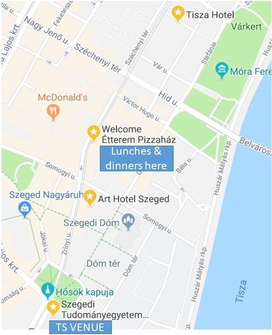

# NEUBIAS Bioimage Analyst School 2018

Dates: Jan 27 - 30th, 2018
Place: Szeged, Hungary

Organizers: Kota Miura, Chong Zhang & Jean-Yves Tinevez

## Aim

The school aims at providing bioimage analysts with practical access to the latest bioimage analysis workflows and their components. Many software/library packages are updated and new ones are appearing on daily basis, but analysts tend to be constrained to what one knows already and omit the use of new components. They are too busy. We hope that this school will become a good chance for analysts to be exposed to the latest scene in the bioimage analysis, of various workflows and workflow components, to widen their scope and broaden their skills.

The school program is largely renovated from last year, based on the feed-backs of participants. 

## Place and Time

### Place
Irinyi Building, University of Szeged  

**Address:**  
**Szeged, Tisza Lajos krt. 103.**   
[Google Map](https://goo.gl/maps/Ht6XGuZ8Szt)

### Time

Jan 27 (Sat) 11:00  - Jan 30 (Tue) 18:00, 2018 

Registration on the fist day starts  from 10am.  

**For more detailed schedule, see [here](https://docs.google.com/spreadsheets/d/1WCevAgjsBsMp7i2cOdKCES6arct8oC_nhGJfWr-PQs0/edit?usp=sharing).**

## The program ./kmkm

The school will be with four types of modules: **Workflow Deconstruction**, **Algorithms of Workflow Components**, **Forums** and **Implementation**. 

In **Workflow Deconstruction**, we reproduce, trace and modify bioimage analysis workflows. Invited speakers and selected workflow authors from participants present their bioimage analysis workflow in details: the biological problem, algorithms of components including statistical analysis, how they are assembled into the workflow to output either numbers, plots or visualization results. In parallel with these explanations, participants will load those components and reproduce the workflow on their own laptop (reproduce the workflow). Interactive discussion on each of the components, the overall design of the workflow and capability of running the workflow in various environments are moderated. 

In **Algorithms of Workflow Components**, invited speakers present in-depth explanation about workflow components. These talks are aimed at encouraging participants to expand their knowledge towards the utilization of more efficient, more precise algorithms in their workflow. Following discussions are moderated. 

1. Discussion and comparison with similar components (plugins, a function in a library, etc) implemented for similar purpose
2. Discussion on interoperability. How to use that component in various ecosystems e.g. Java, Python, MATLAB, R. 

In **Forums**, we will discuss various aspects related to bioimage analysis - with interests surrounding analysts as a profession  (e.g. How do we teach bioimage analysis?). Discussion results are summarized and will be reported to the NEUBIAS community.

In **Implementation**, participants are split into several groups, and each group implements one of the following issues:

1. Modification of workflows presented in the school, for either 
   1. the full workflow running in different ecosystems
   2. a part of the workflow replaced with a different component. 
2. Comparison and benchmarking of workflow components with similar algorithms. The target components should be selected by each group. 

## Participation

Participants are expected to be bioimage analysts, analyzing biological image data on daily basis. 

We expect a fluency in at least one programming language. We do not teach coding, but intensively do coding using several different languages. Skills / flexibility to follow such sessions are a prerequisite. 

Please bring your own laptop! We do not provide machines.  

There will be no helpers during all sessions. We rather promote attending bioimage analysts to to help each other, also for the networking 

During registration, the applicant is asked to submit at least one bioimage analysis workflow that one has authored / worked on (starting with a specific biological question, describe the workflow in a short paragraph and the type of results: numbers, plots and/or visualization - does not have to be a published paper). Among these applicants, some are selected for presentation as "Workflow Deconstruction" session and lead the session. 

## Workflow Deconstruction: Details

  * Tracing the workflow, starting with sample image data, understand the biological problem, do image processing and data analysis, ends up in numbers, plots or visualizations. 
  * Explanation for each step (or each component) are given and interesting algorithms are picked up and discussed in details. 
  * Each participant uses ones own laptop to reproduce / modify the workflow
  * Interactions: questions on components, a proposal for alternative solutions, discussion on capability in other ecosystems. 
  * Invited "workflow authors" + Selected "workflow authors" from applicants (registration form should include an abstract of submission of interesting workflow)

### Invited Workflow Deconstruction Authors

1. Assaf Zaritsky
   * Cell migration / membrane dynamics analysis / statistics workflows
   * Assaf will also give talks in the symposium. 

2. Molnár Csaba
   *  High Content Image Data Screening and Analysis
   *  Csaba is also a local organizer of the conference. 
3. Vasja Urbancic
   * Filopodia quantification and statistical analysis (Filopodyan)
     * [Instructions (installations and misc)](https://github.com/miura/NEUBIAS_AnalystSchool2018/blob/master/NEUBIAS_Analysis_of_filopodia_dynamics.md)
   * [The Paper](http://jcb.rupress.org/content/early/2017/07/28/jcb.201705113) 

## Workflows, Student Presentations

Presentation of welected workflows submitted by students

- Jagadish Sankaran (National University of Singapore)
- Hendrik Deschout (Centre for Cellular Imaging, University of Gothenburg)
- Tobias Rasse (ALMF, EMBL)
- Ziqiang Huang (Light Microscopy Facility CRUK Cambridge)
- Tong Li (Centre de Biologie Intégrative, Laboratory of Cellular and Molecular Biology of Control of Proliferation)

Workflow outlines will be available in a separate file in this repository. 

## Components and their algorithms

"Components": One-hour talks introducing workflow components. Not only about algorithms, they are developing, but more with an overview.

* Invited speakers. 
  * Jean-Yves Tinevez ([Link](https://research.pasteur.fr/en/member/jean-yves-tinevez/))
     * "A short dive into single-particle tracking core algorithms in BioImaging."
  * Tobias Pietzsch ([Link](https://github.com/tpietzsch))
     * Overview of visualization methods
  * Anna Kreshuk ([Link](https://hciweb.iwr.uni-heidelberg.de/Staff/akreshuk))
     * Anna will also appear in the symposium and give a more general talk about iLastik
     * headless usage of iLastik
  * Vannary Meas-Yedid Hardy ([link](https://research.pasteur.fr/en/member/vannary-meas-yedid-hardy/))
     * [potential talk] Natural History of Segmenting Biological Objects 
  * Fabrice Cordelieres ([Link](https://www.researchgate.net/profile/Fabrice_Cordelieres))
     * Colocalization from single molecules to cells 

## Forums

Forums are moderated in between sessions. 

- Discussion on working environments: how each is interacting with biologists, how they are teaching. Recommended teaching methods, failed teaching methods. 
- "Bioimage analysis workflow of the year": share your opinion / comments on recent bioimage analysis workflows that impressed you. 

## Implementations / Presentations

School participants are asked to present their implementations (by group) on the last day of the school. 

